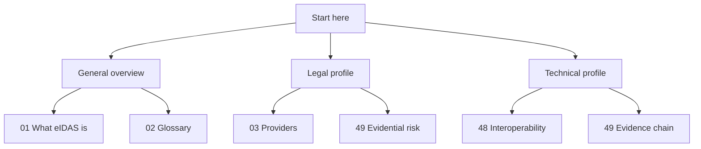

# 00. Quick Guide to the eIDAS Tutorial

## Introduction

This document is the quick entry point to the project. If you do not want to start with the entire tutorial structure, this page helps you choose where to begin depending on your profile or objective.

## What This Project Is in One Sentence

It is an educational tutorial about the European eIDAS framework, digital identity, trust services, and the transition toward eIDAS 2.0 and the European Digital Identity Wallet.

## If You Only Want a General Overview

Start with:

1. [What the eIDAS Regulation Is](./01-what-is-eidas.md)
2. [Basic eIDAS Glossary](./02-eidas-glossary.md)
3. [Trust Service Providers](./03-trust-service-providers.md)
4. [Simple, Advanced, and Qualified Electronic Signatures](./04-electronic-signatures.md)
5. [eIDAS 2.0 and the European Digital Identity Wallet](./11-eidas-2.md)

## If You Come from a Legal Background

Recommended order:

1. [What the eIDAS Regulation Is](./01-what-is-eidas.md)
2. [Trust Service Providers](./03-trust-service-providers.md)
3. [eIDAS 2.0 and the European Digital Identity Wallet](./11-eidas-2.md)
4. [Evidence Chain and Evidential Risk](./49-evidence-chain-and-evidential-risk.md)

## If You Come from a Technical Background

Recommended order:

1. [Basic eIDAS Glossary](./02-eidas-glossary.md)
2. [Trust Service Providers](./03-trust-service-providers.md)
3. [Cross-Border Interoperability and Recognition](./48-cross-border-interoperability.md)
4. [Evidence Chain and Evidential Risk](./49-evidence-chain-and-evidential-risk.md)

## Quick Entry Map

## Summary

This quick guide helps readers enter the tutorial without having to process the full structure at first glance.
