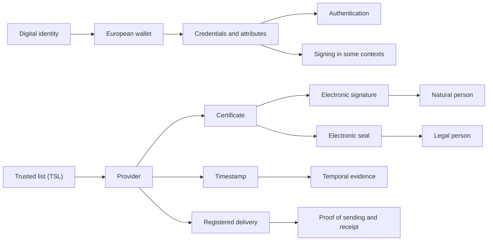

# 17. Relationship Map Between Signature, Seal, Certificate, and Wallet

## Introduction

Some of the most frequent confusion in eIDAS comes from concepts that are connected but not equivalent.

## Key Idea

Certificates, signatures, seals, timestamps, delivery services, and wallets are related pieces of the same ecosystem, but each serves a different function.

## Summary

The map helps show how identity, certificates, evidence, and trust services fit together without collapsing them into the same concept.
