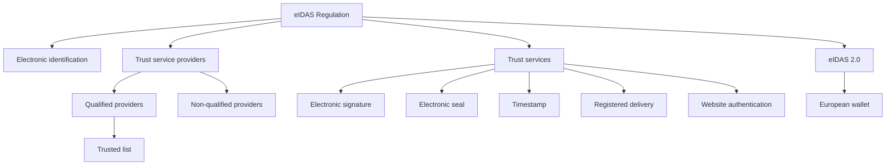

# 24. Visual Overview of the eIDAS Ecosystem

## Introduction

This diagram provides a compact visual overview of the main elements of the eIDAS ecosystem.

## Summary

The diagram helps readers see how legal, institutional, technical, and evidential elements fit together.
