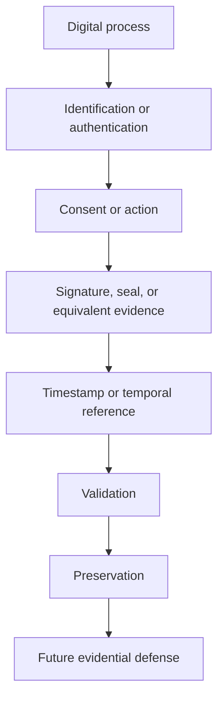

# 49. Evidence Chain and Evidential Risk

## Introduction

One of the core ideas behind the project is that the legal strength of a digital process does not depend only on the existence of a signed document.

What often matters is the full evidence chain:

- who acted
- what was done
- when it happened
- how it was authenticated or evidenced
- how it can later be defended

## What the Evidence Chain Is

The evidence chain is the set of elements that allow a digital process to be reconstructed and defended later.

It may include:

- identification or authentication
- statement of intent or consent
- signature or seal
- timestamp
- delivery evidence
- logs
- validation results
- preservation measures

## Evidential Risk

Evidential risk is the risk of being unable to prove a relevant digital fact when a dispute, audit, or later review arises.

## Practical Point

Not every process needs the same formal intensity. Higher-risk scenarios usually justify stronger evidence generation, validation, and preservation.

## Summary

The real strength of a digital process often lies in the quality of its evidence chain, not only in the final document.
